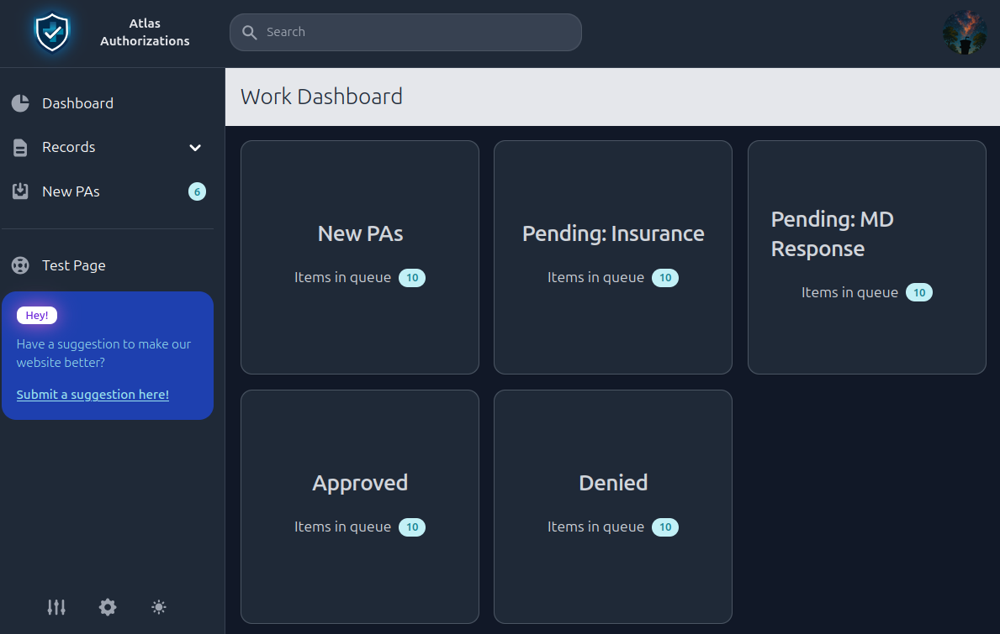

# Key Pharma Consulting (Atlas Authorizations)

AtlasAuth is a healthcare-focused web application built during a six-month school internship in the United States. The project was created for a small company that wanted to begin building software for healthcare workflows. I programmed the full application myself, combining my background as a pharmacist with my interest in software development.

The goal of the project is to provide a foundation for a secure healthcare portal with separate spaces for public visitors, internal staff, providers, and future API access. The app is not just a static site. It includes authentication, role-aware routing, account settings, provider record management, patient-related data models, reusable address records, user suggestions, and a Docker-based local deployment setup.

I also made a video to present this project at school which you can watch here: https://youtu.be/y_qfOvyfGs0

## What It Does

- Provides a public-facing website for Atlas Authorizations.
- Supports user registration, login, logout, password reset, password change, and email-based login codes through `django-allauth`.
- Separates users into staff and provider areas using subdomains such as `staff.atlasauth.lan` and `provider.atlasauth.lan`.
- Restricts protected areas by Django group membership, so staff and providers see different parts of the system.
- Includes staff account settings with profile details, avatar upload, and optional email two-factor login.
- Includes provider record management with create, view, update, and delete flows.
- Models healthcare-adjacent records such as providers, patients, addresses, phone numbers, and user suggestions.
- Runs locally with Docker using separate services for Django, Nginx, and MySQL.
- Uses Tailwind CSS and Flowbite for the interface.

## What I Built

The application is structured around different types of users and healthcare records. Its most developed workflow is a staff-facing provider records area where authenticated users can create, view, and delete provider information, including contact details and addresses. An update workflow is also present and is still being refined.

The repository also includes a public website, staff and provider portals, account settings, a user suggestion form, and foundations for future patient records, prior authorization records, notes, logs, and API endpoints.

## What I Learned

- **Building a CRUD application:** I created forms, views, templates, validation rules, and database operations for a provider-record management workflow, including an update flow that I iterated on during development.
- **Designing relational database models:** I used Django models and MySQL to represent users, providers, addresses, patients, and suggestions. Related provider and address records are saved together inside database transactions.
- **Implementing role-based security:** Staff and provider areas use separate subdomains. Custom middleware checks authentication and Django group membership before allowing access to restricted areas.
- **Securing authentication flows:** I extended Django's user model and integrated `django-allauth` for login, signup, logout, password reset, and password change workflows. I also added password validation, CSRF-protected forms, login rate-limit tests, signup bot protection, and optional email login codes with resend limits.
- **Working across the full stack:** I built server-rendered Django pages and styled them with Tailwind CSS and Flowbite components.
- **Containerizing a web application:** I used Docker Compose to run Django, MySQL, and NGINX services. NGINX acts as a reverse proxy and redirects local HTTP traffic to HTTPS using a development certificate.

## Tech Stack

- Python and Django
- Django allauth
- Django hosts
- MySQL
- Docker Compose
- Nginx
- Tailwind CSS
- Flowbite

## Project Scope

AtlasAuth is an internship prototype and learning project, not a production healthcare system. Provider record management and account security received the most development attention. I layed the groudwork for this project and left the source code for the business to continue to develop after I left. Also while programming, I left detailed notes so that later workers could pick up where I left off. This project was managed inside GitHub, so I used issues and project boards to detail todos for future developers.